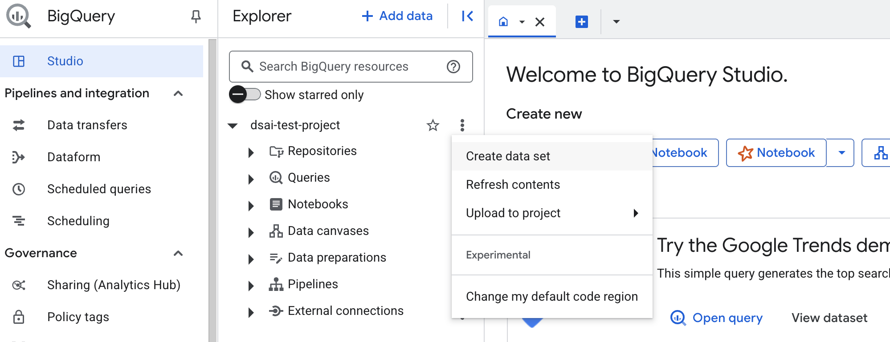
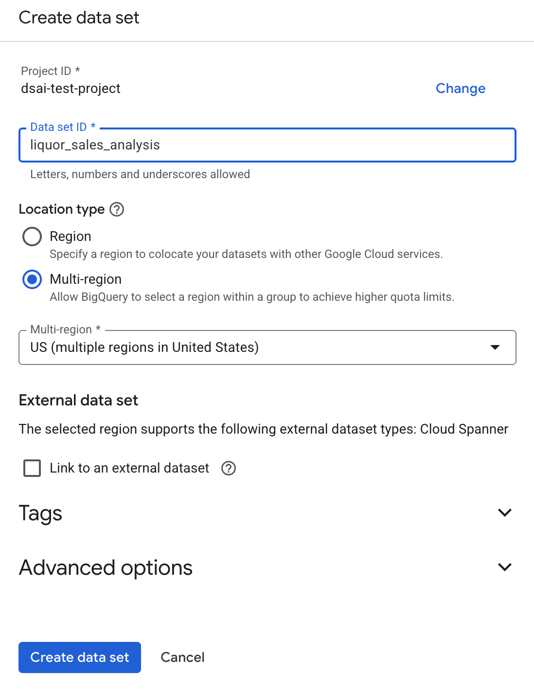
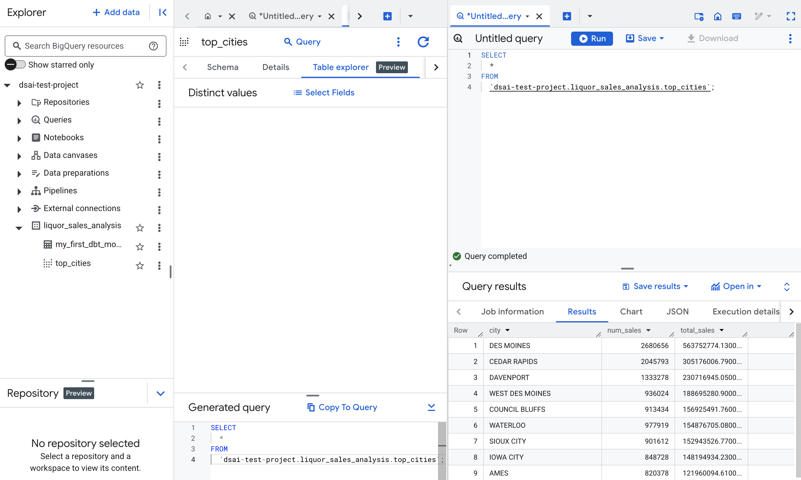
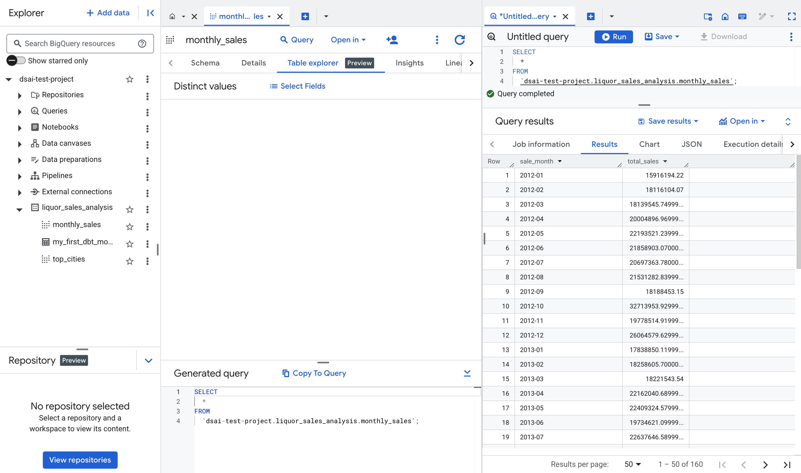
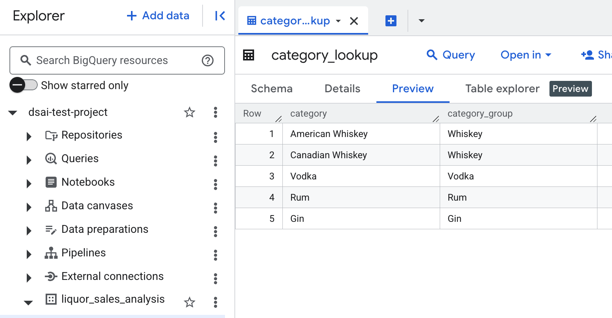
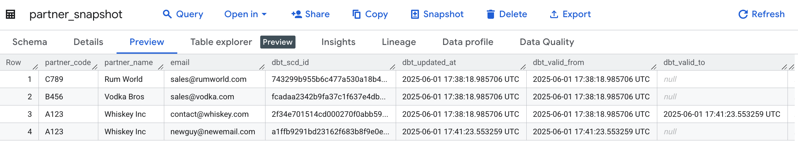

# dbt

[dbt](https://www.getdbt.com/) (data build tool) has become a popular tool in the data engineering and analytics community for its ability to streamline the process of transforming raw data into a more usable format. It allows users to define models, which are SQL queries that transform data, and then run these models to create tables or views in their data warehouse. It follows the **"T"** in **ELT (Extract, Load, Transform)** - **Extract** data from various sources, **Load** it into a data warehouse, and then **Transform** it using SQL queries defined in dbt models.

There are 2 versions of dbt:

1. **dbt Core**: This is the open-source version of dbt that can be run locally or on a server. It provides the core functionality for building and running data transformations.
2. **dbt Cloud**: This is a managed service that provides additional features such as scheduling, collaboration, and a web-based interface for managing dbt projects. It is particularly useful for teams that want to collaborate on data transformations without managing their own infrastructure.

## Getting Started with dbt

To get started with dbt, you need to install it and set up a project. Here are the steps:

1. **Install dbt**: You can install dbt using pip if it is not already installed:
   ```bash
   pip install dbt
   ```
   If you are using a specific data warehouse, you just need to install the corresponding dbt adapter. For example, for BigQuery, you would run:
   ```bash
   pip install dbt-bigquery
   ```
   This would install the dbt core and the corresponding adapter.
2. **Create a new dbt project**: You can create a new dbt project using the following command:
   ```bash
   dbt init my_project
   ```
3. **Configure your dbt profile**: dbt uses a `profiles.yml` file to configure the connection to your data warehouse. You can create this file in the `~/.dbt/` directory. The configuration will depend on the data warehouse you are using (e.g., BigQuery, Snowflake, Redshift, etc.).
4. **Create models**: Models are SQL files that define the transformations you want to apply to your data. You can create a new model by creating a new SQL file in the `models` directory of your dbt project.
5. **Run dbt**: You can run your dbt models using the following command:
   ```bash
   dbt run
   ```
6. **Test your models**: You can test your models using the following command:
   ```bash
   dbt test
   ```

### Additional Information on `profiles.yml`:

> When you invoke dbt from the command line, dbt parses your dbt_project.yml and obtains the profile name, which dbt needs to connect to your data warehouse.
> dbt then checks your profiles.yml file for a profile with the same name. A profile contains all the details required to connect to your data warehouse.
>
> dbt will search the current working directory for the profiles.yml file and will default to the ~/.dbt/ directory if not found.
>
> This file generally lives outside of your dbt project to avoid sensitive credentials being checked in to version control, but profiles.yml can be safely checked in when using environment variables to load sensitive credentials.
> Source: https://docs.getdbt.com/docs/core/connect-data-platform/connection-profiles

This means you can either use the default `~/.dbt/profiles.yml` file or create a new one in your dbt project directory. The latter is useful for managing different environments (e.g., development, staging, production) within the same project.

## Iowa Liquor Sales Dataset Example

We will use the Iowa Liquor Sales dataset as an example to demonstrate how to set up a dbt project and create models. The dataset contains sales data for liquor stores in Iowa, including information about the products sold, sales amounts, and dates. This dataset `bigquery-public-data.iowa_liquor_sales.sales` is already available in BigQuery, so we can use it directly in our dbt project.

## Setup BigQuery Project

### Enable BigQuery API

1. Go to the [Google Cloud Console](https://console.cloud.google.com/).
2. Select or create a Google Cloud project if you don't have one.
3. Search for "BigQuery API" in the search bar.
4. Click on "Enable" to enable the BigQuery API for your project.

This can also be enabled using the command line:

```bash
# Set default project if not already set
gcloud config set project YOUR_PROJECT_ID
gcloud services enable bigquery.googleapis.com
```

BigQuery can be accessed via the [BigQuery web UI](https://console.cloud.google.com/bigquery) or using the [bq command-line tool](https://cloud.google.com/bigquery/docs/bq-command-line-tool).

### Create a BigQuery Dataset

1. In the BigQuery web UI, click on your project name in the left sidebar.
2. Make sure you are in the correct project.
3. On the left panel, click on the "Create Dataset" button.

   

4. Name your dataset (e.g., `liquor_sales_analysis`), select the data location (`US` because we are querying public data), and click "Create Dataset".

   

You can preview the public dataset in BigQuery by navigating to `bigquery-public-data.iowa_liquor_sales.sales` (https://console.cloud.google.com/marketplace/product/iowa-department-of-commerce/iowa-liquor-sales) in the BigQuery web UI or using the following SQL query:

```sql
SELECT *
FROM `bigquery-public-data.iowa_liquor_sales.sales`
LIMIT 10;
```

We can now run SQL queries using this public dataset and store results in our own dataset.

## Set Up a dbt Project with BigQuery

With our BigQuery dataset set up, we can now use dbt to transform the data.

To use dbt with BigQuery, follow these steps:

1. **Install dbt BigQuery Adapter**: If you haven't already, install the dbt BigQuery adapter:
   ```bash
   pip install dbt-bigquery
   ```
   This is the adapter that allows dbt to connect to BigQuery and run transformations. It includes code for connecting to BigQuery, SQL dialect support, integration with GCP authentication, and more. Every data warehouse has its own dbt adapter, so make sure to install the correct one for your data warehouse.
2. **Create a dbt Project**: Create a new dbt project:

   ```bash
   dbt init liquor_sales_dbt
   ```

   You will need to enter these values when prompted.

   - Which database would you like to use? (Select BigQuery)
   - Desired authentication method option (Select `oauth` for OAuth authentication)
   - project (GCP project id): Enter your GCP project ID (e.g., `dsai-test-project`)
   - dataset (the name of your dbt dataset): Enter the name of your BigQuery dataset (e.g., `liquor_sales_analysis`)
   - threads (1 or more): Enter the number of threads you want to use (e.g., `4`)
   - job_execution_timeout_seconds [300]: You can leave this as default or specify a different timeout.
   - Desired location option (Select `US` for the US location)

   Note that the dataset refers to the BigQuery dataset you created earlier (`dsai-test-project.liquor_sales_analysis`), and not the public dataset (`bigquery-public-data.iowa_liquor_sales.sales`).

3. **Check the output**: This will create a new directory called `liquor_sales_dbt` with the necessary files and directories for a dbt project, which will be connected to your BigQuery dataset. It will also generate a `profiles.yml` file in the `~/.dbt/` directory with the connection details for your BigQuery dataset. If you need to modify the connection details, you can edit the `profiles.yml` file directly.

   ```yaml
   liquor_sales_dbt:
     outputs:
       dev:
         dataset: liquor_sales_analysis
         job_execution_timeout_seconds: 300
         job_retries: 1
         location: US
         method: oauth
         priority: interactive
         project: dsai-test-project
         threads: 4
         type: bigquery
     target: dev
   ```

## dbt Project Structure

The dbt project structure will look like this:

```
liquor_sales_dbt/
├── analyses/
├── macros/
├── models/
│   └── example/
│       └── my_first_dbt_model.sql
│       └── my_second_dbt_model.sql
├── seeds/
├── snapshots/
├── tests/
├── dbt_project.yml
└── README.md
```

- `analyses/`: Used for ad-hoc analyses that are not part of the main dbt models. Not materialized as tables/views. This is like a sandbox for running exploratory queries or analyses that you don't want to include in your main dbt models.
- `macros/`: Store custom Jinja macros that can be reused across your dbt models. Macros are reusable SQL snippets that can be called in your models to avoid duplication and make your code cleaner.
- `models/`: For dbt models, which are SQL files that define the transformations you want to apply to your data. You can create subdirectories here to organize your models. In dbt, models are just SQL files with `SELECT` statements which materializes as a result or view in your data warehouse.
- `seeds/`: Used for seed data, which are static CSV files that can be loaded into your data warehouse. You can place CSV files here, and dbt will create tables from them. Useful for static reference data e.g. country codes, product categories, etc.
- `snapshots/`: For dbt snapshots, which are used to capture historical changes in your data.
- `tests/`: Used for dbt tests, which are used to validate your data.
- `dbt_project.yml`: This file contains the configuration for your dbt project, including the project name, version, and other settings.

## The Purpose of dbt + BigQuery

We have a large dataset in BigQuery (`bigquery-public-data.iowa_liquor_sales.sales`) that contains sales data for liquor stores in Iowa. Raw data is often messy or not in a format that is easy to analyze. It may contain duplicate records, inconsistent data types, or other issues that make it difficult to work with.

The goal is to use dbt to transform this raw data into a more usable format, create models that can be used for analysis, and store the results in our own BigQuery dataset (`dsai-test-project.liquor_sales_analysis`). In other words, dbt turns our raw warehouse data into clean, documented, and tested datasets that are ready for analysis, all with SQL and version control.

These final models can then be plugged into BI tools like Looker, Tableau, or Power BI for visualization and reporting.

## Creating a dbt Model

In dbt, a model is simply a SQL file that contains a `SELECT` statement. When you run dbt, it will execute the SQL in the model and create a table or view in your data warehouse.

Every model is typically created to answer a specific business question or to provide a specific dataset for analysis.

| Question                                               | Model Name                          | Description                                                                |
| ------------------------------------------------------ | ----------------------------------- | -------------------------------------------------------------------------- |
| What were the top 10 cities by liquor sales last year? | `top_cities_by_sales_last_year.sql` | This model will aggregate sales data by city and filter for the last year. |
| How much revenue did each category generate per month? | `monthly_revenue_by_category.sql`   | This model will calculate monthly revenue for each liquor category.        |
| What is the average sale amount per store              | `avg_sale_per_store.sql`            | This model will calculate the average sale amount for each store.          |

Let's create the first model to answer the question: "Which 10 cities had the highest liquor sales?"

Crate a `top_cities.sql` in `models/example` directory with the following content:

```sql
-- This model calculates the top 10 cities by liquor sales
SELECT
  city,
  COUNT(*) AS num_sales,
  SUM(sale_dollars) AS total_sales
FROM `bigquery-public-data.iowa_liquor_sales.sales`
GROUP BY city
ORDER BY total_sales DESC
LIMIT 10
```

Run the model using the following command:

```bash
dbt run --select top_cities
```

To run all models in the project, you can simply run:

```bash
dbt run
```

Verify that the model was created successfully by checking the BigQuery dataset `dsai-test-project.liquor_sales_analysis` for a new table or view named `top_cities`.



By default, dbt creates views for models. If you want to create tables instead, you can specify the materialization strategy in the model file or in the `dbt_project.yml` file.

You can specify the materialization strategy in the model file by adding a configuration block at the top of the SQL file:

```sql
{{ config(materialized='table') }}
```

You can also set the default materialization strategy for all models in the `dbt_project.yml` file:

```yaml
models:
  example:
    materialized: table
```

Materialization strategies in dbt determine how the model is stored in the data warehouse. The most common strategies are:

| Materialization | Stored As         | When to Use                                                                                            |
| --------------- | ----------------- | ------------------------------------------------------------------------------------------------------ |
| **view**        | View              | When the data is frequently updated or queried, and you want to always get the latest data.            |
| **table**       | Table             | When the data is large and does not change frequently, or when you want to optimize query performance. |
| **incremental** | Incremental Table | When the data is large and frequently updated, and you want to only process new or changed data.       |

For exploration, practice or frequently changing data, using `view` is often sufficient - this will avoid cluttering BigQuery with full tables and makes model updates fast. For large datasets or production models, `table` or `incremental` materialization strategies are preferred for performance optimization. This is because views are not stored physically in the data warehouse, so every time you query a view, it runs the underlying SQL query. This can be slow for large datasets. Tables, on the other hand, store the results of the query physically, which makes querying faster.

## Trying a Second Model

Now let's create a second model to answer the question: "What are the total liquor sales per month across all cities?"

Create a `monthly_sales.sql` in the `models/example` directory with the following content:

```sql
--  This model calculates the total liquor sales per month
{{ config(materialized='view') }}

SELECT
  FORMAT_DATE('%Y-%m', date) AS sale_month,
  SUM(sale_dollars) AS total_sales
FROM `bigquery-public-data.iowa_liquor_sales.sales`
WHERE date IS NOT NULL
GROUP BY sale_month
ORDER BY sale_month
```

Run the model using the following command:

```bash
dbt run --select monthly_sales
```

Verify that the model was created successfully by checking the BigQuery dataset `dsai-test-project.liquor_sales_analysis` for a new view named `monthly_sales`.



Each time you makes changes to your model, you can run `dbt run` again to update the view or table in BigQuery. dbt will automatically detect changes and re-run the SQL to create the updated model.

## sources.yml

In dbt, a `sources.yml` file is used to define the source data that your models will use. This is particularly useful when you are working with raw data from external sources, such as public datasets or data from other systems.

Previously, we used the `bigquery-public-data.iowa_liquor_sales.sales` table directly in our models. However, it is a good practice to define this source in a `sources.yml` file to make it clear where the data is coming from and to enable better documentation and testing.

Create a `sources.yml` file in the `models/example` directory with the following content:

```yaml
version: 2

sources:
  - name: iowa_liquor_sales
    database: bigquery-public-data
    schema: iowa_liquor_sales
    tables:
      - name: sales
```

This file defines a source named `iowa_liquor_sales` that points to the `bigquery-public-data.iowa_liquor_sales.sales` table. The `version: 2` line indicates that this is using dbt's version 2 schema for sources.

You can now reference this source in your models using the `source` function. For example, you can modify the `monthly_sales.sql` model to use the source:

```sql
--  This model calculates the total liquor sales per month
{{ config(materialized='view') }}

SELECT
  FORMAT_DATE('%Y-%m', date) AS sale_month,
  SUM(sale_dollars) AS total_sales
FROM {{ source('iowa_liquor_sales', 'sales') }}
WHERE date IS NOT NULL
GROUP BY sale_month
ORDER BY sale_month
```

## Seeds

In dbt, seeds are static CSV files that can be loaded into your data warehouse as tables. They are useful for reference data that does not change frequently, such as lookup tables or configuration data.

Create a `category_lookup.csv` file in the `seeds` directory with the following content:

```csv
category_name,category_group
SPICED RUM,Rum
COCKTAILS/RTD,Ready to Drink
IMPORTED VODKAS,Vodka
WHITE CREME DE CACAO,Other
WHITE CREME DE MENTHE,Other
```

> Refer to `category_lookup.csv` for the full list.

Run the following command to load the seed data into your BigQuery dataset:

```bash
dbt seed
```

This will create a new table named `category_lookup` in your BigQuery dataset (`dsai-test-project.liquor_sales_analysis`).



Now we can create a model that joins the sales data with the category lookup table to get the category group for each sale. Create a `sales_by_category.sql` file in the `models/example` directory with the following content:

```sql
--  This model calculates the total liquor sales by category
{{ config(materialized='view') }}

SELECT
  s.category_name,
  c.category_group,
  SUM(s.sale_dollars) AS total_sales
FROM `bigquery-public-data.iowa_liquor_sales.sales` AS s
JOIN {{ ref('category_lookup') }} AS c
  ON s.category_name = c.category_name
GROUP BY s.category_name, c.category_group
```

## Snapshots

A snapshot in dbt is used to track changes over time in your dimension tables, using a technique called Slowly Changing Dimensions (SCD). This is useful for capturing historical changes in your data, such as when a product's category changes or when a customer's address changes.

We will demonstrate this by adding a new seed file for partners and creating a snapshot to track changes in partner information over time.

### Create Partner Seed Data

Create a `partner_seed.csv` file in the `seeds` directory with the following content:

```csv
partner_code,partner_name,email
A123,Whiskey Inc,contact@whiskey.com
B456,Vodka Bros,sales@vodka.com
C789,Rum World,sales@rumworld.com
```

Run `dbt seed` to load the seed data into your BigQuery dataset:

### Create the Snapshot

Create `snapshots/partner_snapshot.sql` in the `snapshots` directory with the following content:

```sql


{{
  config(
    target_schema='liquor_sales_analysis',
    unique_key='partner_code',
    strategy='check',
    check_cols=['partner_name', 'email']
  )
}}

SELECT
  partner_code,
  partner_name,
  email
FROM {{ ref('partner_seed') }}


```

Run the following command to create the snapshot:

```bash
dbt snapshot -s partner_snapshot
```

This will create a snapshot table named `partner_snapshot` in your BigQuery dataset (`dsai-test-project.liquor_sales_analysis`). The snapshot will track changes in the `partner_name` and `email` columns for each `partner_code`.

### Simulate a Change

To simulate a change in the partner information, update the `partner_seed.csv` file to change the email of one of the partners:

```csv
partner_code,partner_name,email
A123,Whiskey Inc,newguy@newemail.com
B456,Vodka Bros,sales@vodka.com
C789,Rum World,sales@rumworld.com
```

Re-seed it with `dbt seed -s partner_seed` to update the seed data in BigQuery.

Then, run the snapshot command again:

```bash
dbt snapshot -s partner_snapshot
```

Check the results in BigQuery:



It will show the original version with `dbt_valid_to` filled with a timestamp, while the new will version will have `dbt_valid_to = null`.

This is **Slowly Changing Dimension Type 2 (SCD Type 2)**, which allows you to keep track of historical changes in your data. Each time a change occurs, a new row is created with the updated information, while the old row is marked as no longer valid.

## Testing dbt Models

In dbt, you can write tests to validate your data models. This helps ensure that your data is accurate and meets the expected quality standards. dbt provides built-in tests as well as the ability to create custom tests.

The tests can be defined in:

- `schema.yml` files within the `models` directory, where you can define tests for specific models.
- `model_name.yml` files, which are specific to each model.

You can also define tests in the `tests` directory, which can be run independently of the models, which is less commonly used.

For clarity and maintainability, we can use one YAML file per model to define the tests. For smaller projects, a single `schema.yml` file in the `models` directory can be used to define tests for all models.

### Testing the partner email field

Let's test that the email field in the `partner_seed` is never null.

Create a `models/example/partner_seed.yml` file with the following content:

```yaml
version: 2

models:
  - name: partner_seed
    description: "Seed data for partners"
    columns:
      - name: email
        tests:
          - not_null
```

Note that we place the YAML file in the `models` folder because dbt only read `.yml` files from there.

Run the tests using the following command:

```bash
dbt test --select partner_seed
```

This will run the `not_null` test on the `email` column of the `partner_seed` model. If any rows have a null value in the `email` column, the test will fail, and you will see an error message indicating which rows failed the test.

## Layered Architecture with dbt

In dbt, you can organize your models into layers to create a more structured and maintainable project. This is often referred to as a "layered architecture" or "dbt layers". The most common layers are:
| Layer | Purpose |
| ------------- | ----------------------------------------------------------------------- |
| **Staging** | Contains models that clean and prepare raw data for analysis. |
| **Intermediate** | Contains models that perform additional transformations on the staging data. |
| **Mart** | Contains models that are ready for analysis and reporting. |
You can create subdirectories within the `models` directory to represent these layers. For example:

```
liquor_sales_dbt/
├── models/
│   ├── staging/
│   │   └── staging_sales.sql
│   ├── intermediate/
│   │   └── intermediate_sales.sql
│   └── marts/
│       └── sales_mart.sql
```

This structure allows you to separate the different stages of your data transformation process, making it easier to manage and understand your dbt project.

### Creating a Staging Model

The first step would be to explore the source data to understand the structure and semantics.

For the Iowa Liquor Sales dataset, we should look at all the columns in the `bigquery-public-data.iowa_liquor_sales.sales` table to understand what data is available and how it can be used.

```sql
SELECT *
FROM `bigquery-public-data.iowa_liquor_sales.sales`
LIMIT 10;
```

Or check the columns

```sql
SELECT column_name, data_type
FROM `bigquery-public-data.iowa_liquor_sales.INFORMATION_SCHEMA.COLUMNS`
WHERE table_name = 'sales';
```

| No. | Column Name             | Data Type |
| --- | ----------------------- | --------- |
| 1   | invoice_and_item_number | STRING    |
| 2   | date                    | DATE      |
| 3   | store_number            | STRING    |
| 4   | store_name              | STRING    |
| 5   | address                 | STRING    |
| 6   | city                    | STRING    |
| 7   | zip_code                | STRING    |
| 8   | store_location          | GEOGRAPHY |
| 9   | county_number           | STRING    |
| 10  | county                  | STRING    |
| 11  | category                | STRING    |
| 12  | category_name           | STRING    |
| 13  | vendor_number           | STRING    |
| 14  | vendor_name             | STRING    |
| 15  | item_number             | STRING    |
| 16  | item_description        | STRING    |
| 17  | pack                    | INT64     |
| 18  | bottle_volume_ml        | INT64     |
| 19  | state_bottle_cost       | FLOAT64   |
| 20  | state_bottle_retail     | FLOAT64   |
| 21  | bottles_sold            | INT64     |
| 22  | sale_dollars            | FLOAT64   |
| 23  | volume_sold_liters      | FLOAT64   |
| 24  | volume_sold_gallons     | FLOAT64   |

This will give us an overview of the data, including the columns, data types, and some sample values.

The next step would be to create staging models that clean and prepare the raw data for analysis. This typically involves:

- Renaming columns for consistency and clarity.
- Converting data types if necessary.
- Filtering out unnecessary columns or rows.
  Create a `staging/stg_liquor_sales.sql` file in the `models` directory with the following content:

```sql
-- This model stages the raw sales data for further analysis
{{ config(materialized='view') }}
SELECT
  invoice_and_item_number,
  DATE(date) AS sale_date,
  store_number,
  store_name,
  address,
  city,
  zip_code,
  store_location,
  county_number,
  county,
  category,
  category_name,
  vendor_number,
  vendor_name,
  item_number,
  item_description,
  pack,
  bottle_volume_ml,
  state_bottle_cost,
  state_bottle_retail,
  bottles_sold,
  sale_dollars,
  volume_sold_liters,
  volume_sold_gallons
FROM
  `bigquery-public-data.iowa_liquor_sales.sales`
WHERE sale_date IS NOT NULL
```

### Building an Intermediate Model

Here, we can build dimensions and facts from the staging data.

Dimension tables are used to provide context to the facts, while fact tables contain the actual measurements or metrics.

Based on the fields we can idenfify the following dimensions and facts:
| Dimension Table | Fields |
| ---------------- | ------------------------------------------------------------ |
| **Store** | store_number, store_name, address, city, zip_code, store_location, county_number, county |
| **Vendor** | vendor_number, vendor_name |
| **Product** | item_number, item_description, pack, bottle_volume_ml |
| **Category** | category, category_name |

| Fact Table | Fields                                                                                                                                            |
| ---------- | ------------------------------------------------------------------------------------------------------------------------------------------------- |
| **Sales**  | invoice_and_item_number, sale_date, store_number, vendor_number, item_number, bottles_sold, sale_dollars, volume_sold_liters, volume_sold_gallons |

Create the dimension models in the `intermediate` directory:

```sql
-- models/intermediate/dim_store.sql
SELECT DISTINCT
  store_number,
  store_name,
  address,
  city,
  zip_code,
  store_location,
  county_number,
  county
FROM {{ ref('stg_liquor_sales') }}
```

```sql
-- models/intermediate/dim_vendor.sql
SELECT DISTINCT
  vendor_number,
  vendor_name
FROM {{ ref('stg_liquor_sales') }}
```

```sql
-- models/intermediate/dim_product.sql
SELECT DISTINCT
  item_number,
  item_description,
  pack,
  bottle_volume_ml,
  category,
  category_name
FROM {{ ref('stg_liquor_sales') }}
```

Create the fact model in the `intermediate` directory:

```sql
-- models/intermediate/fact_sales.sql
SELECT
  invoice_and_item_number,
  sale_date,
  store_number,
  vendor_number,
  item_number,
  bottles_sold,
  sale_dollars,
  state_bottle_cost,
  state_bottle_retail,
  volume_sold_liters,
  volume_sold_gallons
FROM {{ ref('stg_liquor_sales') }}
```

### Building a Mart Model

Finally, we can create a mart model that combines the dimensions and facts for analysis. This model will be used for reporting and analysis.

We can use the earlier models we placed in the `example` directory.

`monthly_sales.sql` can be used as a mart model to provide total sales per month:

```sql
--  This model calculates the total liquor sales per month
{{ config(materialized='view') }}

SELECT
  FORMAT_DATE('%Y-%m', sale_date) AS sale_month,
  SUM(sale_dollars) AS total_sales
FROM {{ ref('fact_sales') }}
GROUP BY sale_month
ORDER BY sale_month
```

`sales_by_category.sql` can be used to provide total sales by category:

```sql
--  This model calculates the total liquor sales by category
SELECT
  f.category_name,
  c.category_group,
  SUM(f.sale_dollars) AS total_sales
FROM {{ ref('fact_sales') }} AS f
JOIN {{ ref('category_lookup') }} AS c
  ON f.category_name = c.category_name
GROUP BY f.category_name, c.category_group
```

`top_cities.sql` can be used to provide the top 10 cities by sales:

```sql
--  This model calculates the top 10 cities by liquor sales
{{ config(materialized='view') }}

SELECT
  s.city,
  COUNT(*) AS num_sales,
  SUM(f.sale_dollars) AS total_sales
FROM {{ ref('fact_sales') }} AS f
JOIN {{ ref('dim_store') }} AS s
  ON f.store_number = s.store_number
GROUP BY s.city
ORDER BY total_sales DESC
LIMIT 10
```

## Adding Tests to the Models

To ensure the quality of our data, we can add tests to our models. This will help us catch any issues early in the development process.

`stg_cycle_stations.yml`

```yaml
version: 2

models:
  - name: stg_cycle_stations
    columns:
      - name: station_id
        tests:
          - not_null
          - unique
```
