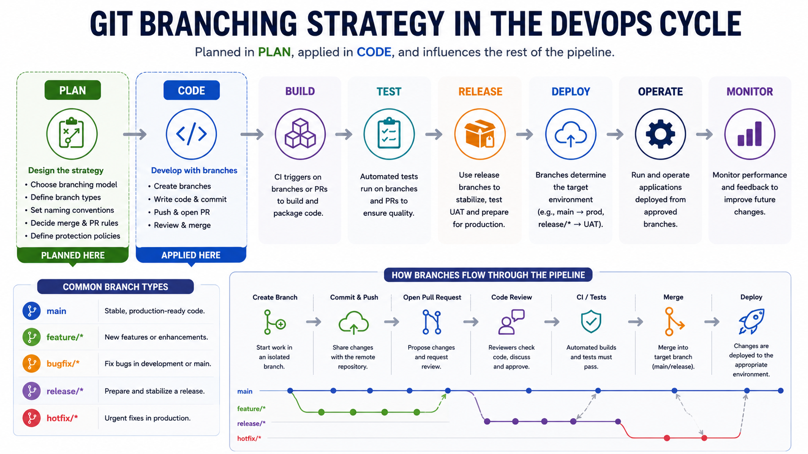
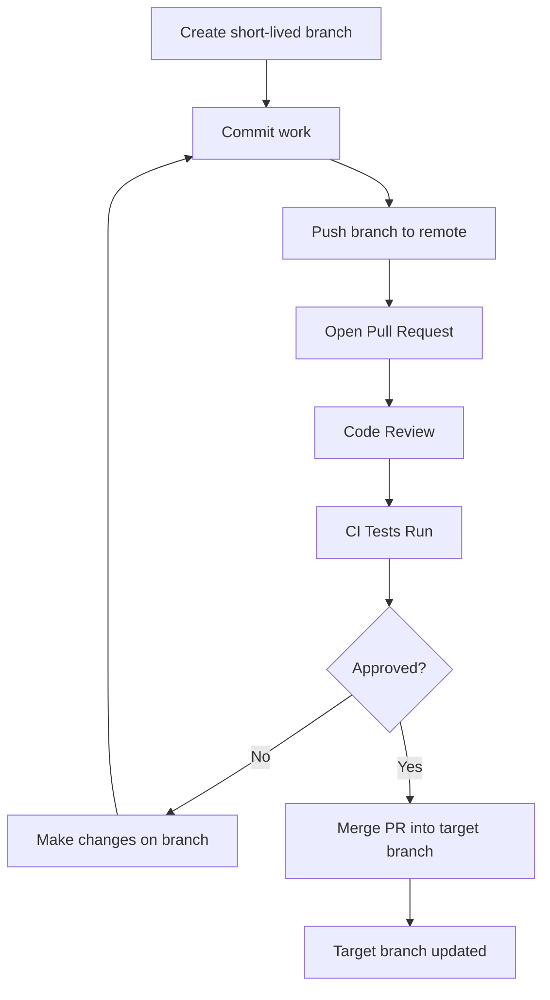
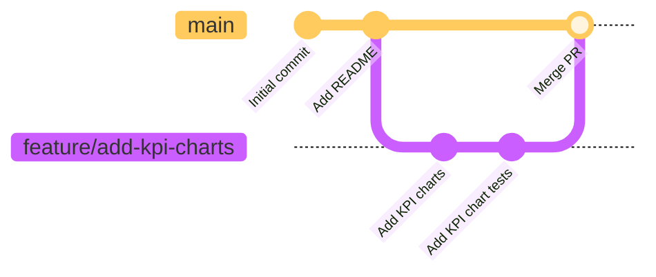
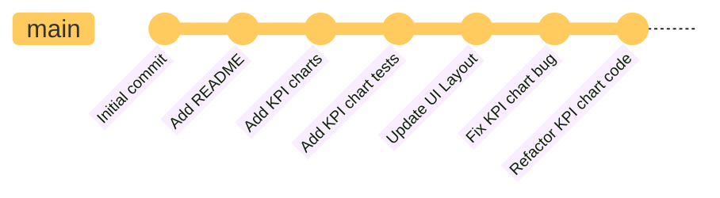
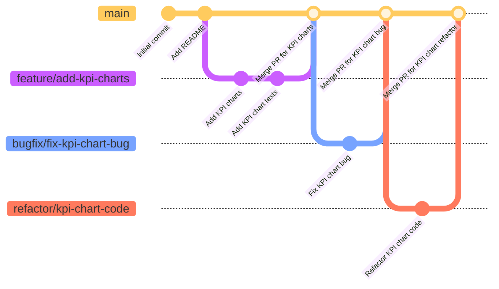
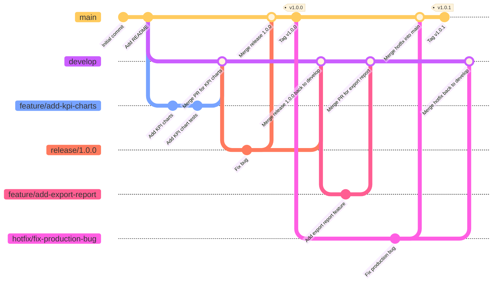

# Git Branching Strategies

Git branches let multiple streams of work happen in the same repository at the same time. A branch can hold a feature, a bug fix, an experiment, a release candidate, or a production hotfix without immediately changing the main line of development.

A **Git branching strategy** is a DevOps practice that defines how teams organize, develop, review, merge, and release code using Git branches. It determines what branches exist, how they are used, and how changes flow from development to production.



The point is not to create lots of branches. The point is to make change management predictable.

Without a branching strategy:

1. Developers may branch from different starting points.
2. Work may sit unmerged for too long.
3. Releases may be assembled manually and inconsistently.
4. Hotfixes may be applied to production but forgotten in development.
5. Nobody is sure which branch represents deployable code.

With a branching strategy:

1. Everyone knows where new work starts.
2. Pull requests have a clear target branch.
3. CI/CD can run the right checks at the right time.
4. Releases can be cut, tested, patched, and tracked.
5. Production history is easier to audit.

---

## The Core Problem

Most teams are balancing three needs:

| Need            | Question                                      |
| --------------- | --------------------------------------------- |
| Integration     | How quickly do we combine everyone's work?    |
| Stability       | Which branch should always be safe to deploy? |
| Release control | How do we decide what goes into a release?    |

Different branching strategies are different answers to those questions.

Small teams usually benefit from fewer long-lived branches. Larger teams, regulated environments, mobile apps, and enterprise products may need more release control.

---

## Common Branch Types

Most strategies use some combination of these branch types.

| Branch type        | Purpose                                                                 | Typical lifetime                          |
| ------------------ | ----------------------------------------------------------------------- | ----------------------------------------- |
| `main` or `master` | The primary line of development; often represents production-ready code | Long-lived                                |
| `develop`          | Integration branch for upcoming work before it reaches `main`           | Long-lived in Gitflow-style workflows     |
| `feature/*`        | Isolated branch for a feature or task                                   | Short-lived                               |
| `bugfix/*`         | Fix for a non-production bug                                            | Short-lived                               |
| `hotfix/*`         | Urgent fix for production                                               | Very short-lived                          |
| `release/*`        | Stabilization branch for an upcoming release                            | Temporary, but may live for days or weeks |
| `chore/*`          | Maintenance work, dependency updates, tooling, or project housekeeping  | Short-lived                               |
| `docs/*`           | Documentation changes                                                   | Short-lived                               |
| `refactor/*`       | Code restructuring without intended behavior changes                    | Short-lived                               |
| `test/*`           | Adding, updating, or fixing tests                                       | Short-lived                               |
| `ci/*`             | CI/CD pipeline or automation changes                                    | Short-lived                               |
| `perf/*`           | Performance improvements                                                | Short-lived                               |
| `security/*`       | Security fixes or hardening work                                        | Short-lived                               |
| `experiment/*`     | Prototype that may never be merged                                      | Short-lived                               |

Branch names are conventions, not Git requirements. The important part is that the team can infer intent from the name.

Examples:

```text
feature/add-login
bugfix/fix-empty-report
hotfix/payment-timeout
release/1.4.0
chore/update-dependencies
docs/git-branching-guide
refactor/extract-auth-service
test/add-login-tests
ci/cache-python-dependencies
perf/speed-up-report-query
security/rotate-api-token
experiment/vector-search
```

---

## Strategies We Will Discuss

This lesson covers five common branching strategies.

| Strategy                | Main idea                                                                                        |
| ----------------------- | ------------------------------------------------------------------------------------------------ |
| GitHub Flow             | Use `main` as the only long-lived branch; merge reviewed short-lived branches back into `main`   |
| Trunk-Based Development | Integrate into `main` very frequently, often with feature flags for incomplete work              |
| Gitflow                 | Use `main`, `develop`, `feature/*`, `release/*`, and `hotfix/*` branches for structured releases |
| GitLab Flow             | Add environment or release branches to a simpler feature-branch workflow                         |
| Forking Workflow        | Contributors work in their own forks and open pull requests into the main repository             |

---

## Feature Branching Workflow and Pattern

Feature Branching can be used as a workflow by itself, but it is also a reusable branching pattern within other workflows.

The core idea is simple: create a dedicated branch for a feature, bug fix, or task, then merge it back into the main line when the work is ready. This keeps unfinished work isolated from the main codebase.

As a standalone workflow, Feature Branching commonly looks like:

```text
main -> feature branch -> review -> merge back to main
```

Feature Branching can also be incorporated into more specific workflows, including GitHub Flow, Gitflow, GitLab Flow, and many trunk-based teams that use short-lived pull request branches.

Those workflows add more explicit rules:

- Which long-lived branches exist?
- Where do feature branches start?
- Where are pull requests merged?
- Which branch represents production?
- How are production hotfixes handled?

With that distinction in mind, we will start with **GitHub Flow**, one of the most common workflows built around the Feature Branching pattern.

---

## Common Pull Request Process

A **pull request** (PR) is a request to review and merge changes from one branch into another branch. It gives the team a place to discuss the change, review the code, run automated checks, and approve the merge. Pull requests are features of hosting platforms such as GitHub, not Git commands.

Pull requests are commonly used with short-lived branches across GitHub Flow, Gitflow, GitLab Flow, forking workflows, and many trunk-based teams.

The target branch depends on the strategy. For example, a pull request may merge into `main`, `develop`, or a release branch. Pure trunk-based teams may allow developers to commit directly to `main` instead.



---

## Strategy 1: GitHub Flow

GitHub Flow is a lightweight branching strategy built around one long-lived branch, usually `main`.

GitHub Flow keeps the model simple:

1. `main` is the only long-lived branch.
2. `main` should always be deployable.
3. Every change starts from a short-lived branch.
4. The branch is reviewed through a pull request.
5. CI checks run before merge.
6. The change is merged back to `main`.
7. Deployments happen from `main`.

### Branch History



**Example:**

1. Alice initializes the repository and adds a `README.md` file on `main`.
2. Bob creates `feature/add-kpi-charts` from `main`.
3. Bob adds the KPI charts and their tests on his feature branch.
4. Bob pushes the branch and opens a pull request into `main`.
5. Alice reviews the pull request. After the checks pass, the feature branch is merged into `main`.

**Typical commands:**

```bash
git switch main
git pull
git switch -c feature/add-kpi-charts

# make changes
git add .
git commit -m "Add KPI charts"
git push -u origin feature/add-kpi-charts
```

Then open a pull request into `main`.

GitHub Flow is commonly used for web apps, SaaS products, internal tools, and teams practising continuous delivery.

**Strengths:**

- Simple mental model.
- Fast for small, frequent changes.
- Works naturally with GitHub pull requests.
- Keeps unfinished work away from `main`.
- Works well with CI checks on every pull request.
- Encourages small changes and frequent integration.

**Tradeoffs:**

- Long-running feature branches become painful to merge.
- Large pull requests are harder to review.
- Requires strong CI and discipline around `main`.
- Release control usually needs tags, deployment automation, or feature flags.
- Less natural when multiple released versions must be supported at the same time.

GitHub Flow is often the best default for small-to-medium software teams.

Pragmatic rule: keep feature branches small and short-lived. A branch that lives for weeks is usually a sign that the work should be split or hidden behind a feature flag.

---

## Strategy 2: Trunk-Based Development

Trunk-based development means developers integrate into a single main branch very frequently. The "trunk" is usually `main`.

There are two common versions:

| Version                                    | How it works                                                                         |
| ------------------------------------------ | ------------------------------------------------------------------------------------ |
| Pure trunk-based development               | Developers commit directly to `main`, protected by strong tests and review practices |
| Short-lived branch trunk-based development | Developers use tiny branches or pull requests, then merge back quickly               |

For short-lived branches, the branches should be merged back to `main` as soon as possible, ideally within a day. The goal is to minimize the time that branches diverge from `main`, which reduces merge conflicts and keeps integration problems visible.

### Branch History

#### Pure trunk-based development



_**Pure TBD**: Direct commits to main_

**Example:**

1. Alice initializes the repository and adds a `README.md` file on `main`.
2. Bob adds KPI charts and their tests directly to `main`.
3. Alice updates the UI layout on `main`.
4. Bob fixes a KPI chart bug and refactors the chart code on `main`.
5. The team integrates each small change immediately instead of keeping separate branches.

#### Short-lived branch trunk-based development



_**PR-based TBD**: Short-lived branches merged quickly into main_

**Example:**

1. Alice initializes the repository and adds a `README.md` file on `main`.
2. Bob creates `feature/add-kpi-charts`, adds the charts and tests, then opens a pull request. The branch is merged into `main` quickly.
3. Alice creates `bugfix/fix-kpi-chart-bug`, fixes the issue, and merges the branch back into `main`.
4. Bob creates `refactor/kpi-chart-code`, makes a small refactor, and merges it back into `main`.
5. The branches are short-lived, so `main` remains the central integration branch.

Both diagrams are Trunk-Based Development because main is the central integration branch, and work is integrated into it frequently. The second diagram still uses branches, but the branches are short-lived and merged back quickly, so it remains trunk-based.

**Strengths:**

- Minimizes merge conflicts.
- Makes integration problems visible early.
- Works well with continuous integration and continuous deployment.
- Encourages small, incremental changes.

**Tradeoffs:**

- Requires excellent automated tests.
- Often needs feature flags to hide incomplete work.
- Can be uncomfortable for teams used to long stabilization periods.

Trunk-based development is common in high-performing teams that deploy frequently.

---

## Strategy 3: Gitflow

Gitflow is a more structured strategy with multiple long-lived branches. These branches are used to manage development, releases and fixes in a more controlled way.

This is often used when teams have scheduled releases, UAT cycles, or have multiple supported versions in production at the same time.

The classic branches:

| Branch      | Purpose                                       |
| ----------- | --------------------------------------------- |
| `main`      | Code that is released or ready to be released |
| `develop`   | Integration branch for ongoing development    |
| `feature/*` | New features branched from `develop`          |
| `release/*` | Stabilization branch before production        |
| `hotfix/*`  | Emergency production fix branched from `main` |

### Branch History



**Example:**

1. Alice initializes the repository on `main`, adds a `README.md` file, and creates the long-lived `develop` branch.
2. Bob creates `feature/add-kpi-charts` from `develop`, implements the charts and tests, then opens a pull request into `develop`.
3. Alice creates `release/1.0.0` from `develop`. During stabilization, the team fixes a bug on the release branch.
4. Alice merges `release/1.0.0` into `main`, tags version `v1.0.0`, and merges the release branch back into `develop`.
5. Bob creates `feature/add-export-report` from `develop`, implements the report feature, and merges it back into `develop`.
6. A production bug is discovered. Alice creates `hotfix/fix-production-bug` from `main`, applies the fix, merges it into `main`, and tags version `v1.0.1`.
7. Alice also merges the hotfix back into `develop` so the fix is included in future work.

**Strengths:**

- Clear separation between development and production.
- Useful when releases are scheduled and manually controlled.
- Supports release stabilization.
- Gives hotfixes a defined path.

**Tradeoffs:**

- More complex.
- `develop` and `main` can drift.
- Release branches can become dumping grounds for late features.
- Often too heavy for teams deploying many times per day.

Gitflow is common in products with planned versioned releases, desktop apps, mobile apps, embedded systems, and organizations with formal release gates.

---

## Strategy 4: GitLab Flow (Optional)

GitLab Flow is a middle ground between GitHub Flow and Gitflow. It usually keeps feature branches, but adds environment or release branches when needed.

Two common variants:

| Variant              | Branches                             | Use case                       |
| -------------------- | ------------------------------------ | ------------------------------ |
| Environment branches | `main`, `staging`, `production`      | Promotion through environments |
| Release branches     | `main`, `release/1.4`, `release/1.5` | Supporting multiple versions   |

**Strengths:**

- More controlled than GitHub Flow.
- Less ceremony than full Gitflow.
- Maps naturally to deployment environments or supported versions.

**Tradeoffs:**

- Environment branches can drift from each other.
- Cherry-picking fixes between branches needs discipline.
- The team must define exactly how promotion works.

---

## Strategy 5: Forking Workflow (Optional)

In a forking workflow, contributors do not push branches to the main repository. They fork the repository, push branches to their own copy, and open pull requests back to the original repository.

The flow:

```text
upstream repository
  ^ pull request
contributor fork
  `-- feature branch
```

This is common in open-source projects because maintainers can review external contributions without giving contributors write access to the main repository.

**Strengths:**

- Good security boundary for public collaboration.
- Works well for open-source contribution.
- Maintainers keep control of the upstream repository.

**Tradeoffs:**

- More setup for contributors.
- Contributors must keep forks synced.
- Less convenient for tight internal teams.

---

## Choosing a Strategy

Start with the simplest strategy that gives enough control.

| Situation                                          | Good default                          |
| -------------------------------------------------- | ------------------------------------- |
| Small team, web app, frequent deploys              | GitHub Flow                           |
| Team wants very frequent integration and strong CI | Trunk-based development               |
| Scheduled releases with stabilization periods      | Gitflow                               |
| Multiple environments need explicit promotion      | GitLab Flow with environment branches |
| Multiple supported product versions                | Release branches                      |
| Public open-source project                         | Forking workflow                      |

Pragmatic recommendations:

- Prefer short-lived branches.
- Protect `main` with pull requests and CI checks.
- Avoid using branches as permanent storage for unfinished work.
- Decide how hotfixes flow back into development before the first emergency.
- Use feature flags when code must merge before the feature is ready for users.

---

## A Practical Default

For many modern teams, this is a strong starting point:

```text
main
  |-- feature/*
  |-- bugfix/*
  `-- hotfix/*
```

Rules:

1. `main` is always deployable.
2. All work happens in short-lived branches.
3. Every branch is merged through a pull request.
4. CI must pass before merge.
5. Hotfixes branch from the current production commit and are merged back to `main`.

This is essentially GitHub Flow. It is simple enough for learning and strong enough for many real projects.

---

## Activity: Practise GitHub Flow

In this activity, one person is the repository owner and at least two people are collaborators. Each collaborator will use a short-lived feature branch and open a pull request into `main`.

The collaborators will intentionally edit the same line in `names.txt`. The first pull request should merge cleanly. The second pull request should produce a merge conflict that must be resolved before it can be merged.

### 1. Owner: Create the repository

Create a new GitHub repository named `github-flow-practice`. Select **Add a README file** when creating the repository so that it starts with an initial commit on `main`.

Clone it locally:

```bash
git clone <repository-url>
cd github-flow-practice
```

### 2. Owner: Add collaborators

In the GitHub repository:

1. Open **Settings**.
2. Select **Collaborators**.
3. Add each collaborator by GitHub username.
4. Ask each collaborator to accept the invitation.

### 3. Owner: Add `names.txt`

Create `names.txt` with a shared header:

```text
Student Names:
```

Commit and push the file:

```bash
git add names.txt
git commit -m "Add names file"
git push origin main
```

### 4. Collaborators: Clone and create feature branches

Each collaborator clones the repository:

```bash
git clone <repository-url>
cd github-flow-practice
```

Collaborator A creates a branch:

```bash
git switch -c feature/add-alice-name
```

Collaborator B creates a different branch:

```bash
git switch -c feature/add-bob-name
```

Each collaborator adds their own name on the line directly below the header in `names.txt`. Because both collaborators add a different name at the same location, the second pull request will produce an intentional merge conflict.

Collaborator A:

```text
Student Names:
Alice
```

Collaborator B:

```text
Student Names:
Bob
```

Each collaborator commits and pushes their branch:

```bash
git add names.txt
git commit -m "Add my name"
git push -u origin <feature-branch-name>
```

### 5. Collaborators: Open pull requests

Each collaborator opens a pull request on GitHub:

```text
base: main <- compare: <feature-branch-name>
```

The owner reviews both pull requests.

Merge Collaborator A's pull request first. `main` now contains:

```text
Student Names:
Alice
```

Collaborator B's pull request should now report a merge conflict because both branches added a different name at the same location.

### 6. Collaborator B: Resolve the merge conflict locally

The repository owner or the pull request author can resolve the conflict if they have write access. The pull request author should usually resolve it because they understand the intent of their change and can verify that the combined result is correct.

As a normal practice, collaborators should sync their feature branch with the latest `main` before the pull request is finalized. This surfaces conflicts before merge. A pull request may still be opened earlier for discussion or review. In this activity, Collaborator B resolves the conflict after opening the pull request so that the conflict-resolution process is visible.

Collaborator B updates their local view of `main`:

```bash
git switch main
git pull origin main
```

Switch back to the feature branch and merge the latest `main` into it:

```bash
git switch feature/add-bob-name
git merge main
```

Git should report a conflict in `names.txt`. Open the file:

```text
Student Names:
<<<<<<< HEAD
Bob
=======
Alice
>>>>>>> main
```

The markers mean:

| Marker         | Meaning                                                   |
| -------------- | --------------------------------------------------------- |
| `<<<<<<< HEAD` | The version from the currently checked-out feature branch |
| `=======`      | Separator between the two versions                        |
| `>>>>>>> main` | The version from the branch being merged in               |

If you are not ready to resolve the conflict, you can abort the merge:

```bash
git merge --abort
```

This returns the feature branch to its state before `git merge main` was run. You might abort when the conflict is larger than expected, you need to clarify the intended result with another developer, or you want to make a backup before trying again.

For this activity, continue with the merge and resolve the conflict.

Edit `names.txt` so it keeps both names and removes the conflict markers:

```text
Student Names:
Alice
Bob
```

Stage and commit the resolved file:

```bash
git add names.txt
git commit
git push
```

This creates one additional merge commit on Collaborator B's feature branch. Git opens an editor with a default message similar to:

```text
Merge branch 'main' into feature/add-bob-name
```

Keep that message because it records that the latest `main` was merged into the feature branch. The commit also contains the resolved version of `names.txt`. It becomes part of the pull request history when the updated branch is pushed.

The existing pull request updates automatically. The owner can review the resolved file and merge the pull request into `main`.

### Preventing merge conflicts

Merge conflicts are normal, but teams can reduce how often they occur:

- Pull changes from `main` frequently so feature branches do not drift too far behind.
- Keep pull requests small so fewer files and lines change at the same time.
- Coordinate when multiple people need to edit high-change files.

### 7. Verify the result

Everyone updates their local `main` branch:

```bash
git switch main
git pull origin main
cat names.txt
```

Expected result:

```text
Student Names:
Alice
Bob
```

### 8. Collaborators: Clean up merged branches

After a pull request is merged, each collaborator should update `main` and remove their completed feature branch locally:

```bash
git switch main
git pull origin main
git branch -d <feature-branch-name>
```

The `-d` option deletes the local branch only if Git considers it safely merged. Use this as the default. Avoid `-D` unless you intentionally want to discard unmerged work.

The remote feature branch should also be deleted after merge. This can happen in either of two ways:

1. Select **Delete branch** on the merged pull request page in GitHub.
2. Delete it from the command line:

```bash
git push origin --delete <feature-branch-name>
```

Finally, prune stale remote-tracking references:

```bash
git fetch --prune
```

This removes local references such as `origin/feature/add-bob-name` after the corresponding remote branch has been deleted. It does not delete active remote branches.

The activity demonstrated the normal GitHub Flow cycle:

```text
create branch -> commit -> push -> open PR -> review -> resolve conflict -> merge -> clean up
```
